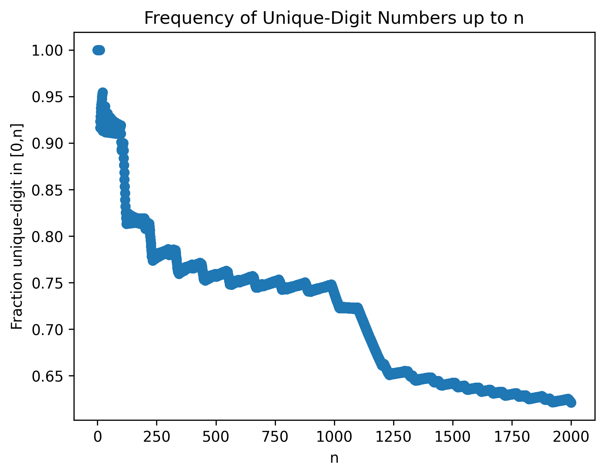

# Unique Digit Analysis
Analyzes pattern of numbers with no repeated digits.
Running the script prompts integer entry and gives a descending list of the largest gaps between numbers with repeated digits up to that integer.

## Functions

- `check_repeated_digits(n, include_leading_zeroes=False)`
Returns a list of all integers in [0,n) whose decimal representation contains no repeated digits.
If `include_leading_zeroes=True`, numbers are padded to equal length before checking.
For example, if  n=2000, 1 is treated as 0001 and therefore has repeated digits.

- `write_data(result, filename)`  
Writes the list of valid numbers to a file to avoid recomputation for large n.

- `plot_frequency(n, filename=None)`  
Plots the running fraction of numbers in [0, n] that have no repeated digits.  
Can either compute directly or read from a precomputed data file.

## Visualization: recursive spikes
The running frequency drops sharply once "per digit," then gradually recovers before dropping again.
This pattern repeats at larger scales, creating a "recursive spike" structure. For example, every 10, one number repeats, causing a small spike.
Every 100, a sequence of 10 numbers in a row will repeat, causing a sharper drop. This pattern repeats at a larger scale every order of magnitude.

For k-digit numbers, the approximate fraction with no repeated digits is
(10 * 9 * 8...(10-k+1))/10^k, which explains the scale-dependent drops we observe.

## Data

- `data/unique_digits_upto_10000.txt`: all numbers in [0, 10000] with no repeated digits, for ease of access.
